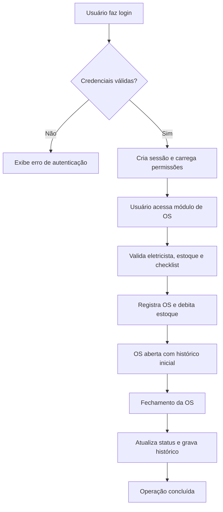

# ⚡ EletroTech

## Visão Geral e Arquitetura

O EletroTech é uma aplicação web de gestão operacional voltada para empresas de soluções elétricas. O sistema centraliza o controle de usuários, eletricistas, produtos, metas, ordens de serviço, movimentações de estoque e um assistente de IA, oferecendo um back-office robusto para operação técnica e administrativa.

Após as melhorias recentes, o projeto passou a oferecer uma base mais modular, regras de negócio mais consistentes e uma suíte de testes estruturada para validar os principais fluxos de persistência e integração com o banco de dados.

### Valor entregue após as melhorias

- Refatoração da camada de negócio para maior clareza e manutenção.
- Implementação de fluxos end-to-end mais consistentes para cadastro, validação e acompanhamento de ordens de serviço.
- Introdução de testes unitários para modelos críticos, com validação de cenários felizes e de borda.
- Estruturação mais limpa de controllers, models e rotas para evolução futura do produto.

### Stack principal

- Back-end: PHP 8+ com CodeIgniter 3
- Banco de Dados: MySQL
- Front-end: HTML, CSS, JavaScript e Bootstrap 5
- Testes: biblioteca nativa de testes do CodeIgniter (`CI_Unit_test`)
- Integração: API do Flowise para o assistente de IA

### Arquitetura do sistema

A aplicação segue o padrão MVC com separação clara entre:

- Controllers: responsável por receber requisições, validar entradas e orquestrar a resposta.
- Models: encapsulam a lógica de acesso ao banco e regras de persistência.
- Views: renderizam os templates das telas do sistema.
- Configuração e infraestrutura: rotas, autenticação, sessão e conexão com o banco.

Fluxo arquitetural simplificado:

```text
Navegador -> Controller -> Model -> MySQL -> View
```

Estrutura principal:

- [eletrotech-ci/application/controllers](eletrotech-ci/application/controllers)
- [eletrotech-ci/application/models](eletrotech-ci/application/models)
- [eletrotech-ci/application/views](eletrotech-ci/application/views)
- [eletrotech-ci/application/config](eletrotech-ci/application/config)

---

## Mapeamento do Novo Fluxo

O fluxo principal reforçado no projeto é o de abertura, validação e fechamento de ordens de serviço, desde o login do usuário até o registro do histórico operacional.

### Passo a passo funcional

1. Autenticação e autorização
   - O usuário acessa a tela de login.
   - As credenciais são validadas e a sessão é criada.
   - O sistema define o perfil e as permissões disponíveis.

2. Acesso ao módulo de ordens de serviço
   - O usuário entra no módulo correspondente.
   - O sistema valida se a ação é permitida para aquele perfil.

3. Criação da ordem de serviço
   - O responsável informa o eletricista, a data da operação e os materiais utilizados.
   - O sistema valida regras de negócio, como eletricista ativo, quantidade positiva e estoque suficiente.

4. Processamento e persistência
   - A OS é criada com status inicial em aberto.
   - O estoque é atualizado de forma atômica, com movimentações registradas no ledger.
   - Checklists e comentários podem ser associados ao registro.

5. Fechamento e histórico
   - Ao fechar a OS, o sistema exige um checklist de encerramento e justificativas para respostas negativas.
   - O status passa a fechado e o histórico fica imutável.

### Diagrama do fluxo



---

## Especificação de Endpoints e Contratos de Aplicação

Como o sistema é majoritariamente baseado em páginas web MVC, os contratos são documentados como rotas de controller e ações. A configuração das rotas está centralizada em [eletrotech-ci/application/config/routes.php](eletrotech-ci/application/config/routes.php).

| Método | Endpoint | Descrição | Payload / Parâmetros | Resposta esperada |
|---|---|---|---|---|
| GET | /auth | Exibe a tela de login | Sem payload | Página de autenticação |
| POST | /auth/entrar | Realiza login | `nome`, `senha` | Redirecionamento para dashboard ou erro flash |
| GET | /auth/sair | Finaliza a sessão | Sem payload | Redirecionamento para login |
| GET | /home | Dashboard inicial | Sem payload | Página inicial do sistema |
| GET | /usuarios | Lista usuários | Sem payload | Lista de usuários e status |
| POST | /usuarios/criar | Cria usuário | `usuario`, `senha`, `is_admin`, `eletricista_id` | Sucesso ou erro de validação |
| POST | /usuarios/editar | Edita usuário | `id`, campos editáveis | Sucesso ou erro de validação |
| GET | /eletricistas | Lista eletricistas | Sem payload | Página com cadastro e histórico |
| POST | /eletricistas/cadastrar | Cadastra eletricista | `nome`, `cpf`, `data_contratacao` | Sucesso ou erro |
| POST | /produtos/cadastrar | Cadastra produto | `nome_produto`, `vlr_unitario`, `qtd_estoque` | Produto criado ou erro |
| POST | /produtos/editar | Edita produto | `id`, `nome_produto`, `vlr_unitario` | Atualização confirmada |
| GET | /produtos/ZerarEstoque/{id} | Zera estoque de um produto | `id` via rota | Sucesso com movimentação de saída |
| POST | /produtos/aumentarQtdEstoque/{id} | Repor estoque | `id`, `qtd_estoque` | Estoque atualizado e movimento de entrada |
| GET | /metas | Lista metas | Sem payload | Lista de metas por período |
| POST | /ordemServico/cadastrar | Registra OS | `eletricista_id`, `produtos`, `checklist` | OS criada ou rejeitada |
| POST | /ordemServico/fechar | Fecha OS | `id_os`, `checklist_fim`, `motivos` | OS fechada com histórico |
| GET | /baixas | Lista movimentações | Filtros opcionais | Relatório de entradas/saídas |
| GET | /chat/{...} | Assistente de IA | Payload via request | Resposta contextual do chatbot |

> [Nota: Assumido que a implementação segue o padrão MVC do CodeIgniter 3 e que as rotas são mapeadas com base no arquivo de rotas do projeto.]

---

## Estratégia de Testes e Qualidade de Código

A suíte de testes foi implementada para validar os modelos principais do sistema, com foco em consistência de dados, regras de negócio e integridade transacional.

### Abordagem adotada

- Testes unitários de modelos via biblioteca nativa do CodeIgniter.
- Uso de transações e rollback para garantir isolamento entre cenários.
- Validação de cenários felizes e cenários de borda, incluindo entradas inválidas e produtos inexistentes.

### Exemplos de cobertura implementada

- Produtos: inserção, atualização, zerar estoque, repor estoque e regressão para produto inexistente.
- Usuários: validação de cadastro, permissões e regras de acesso.
- Checklist: validação de tipos, perguntas e associação com ordens de serviço.
- Metas, eletricistas, baixas e ordens de serviço: validação de regras de negócio e persistência.

### Qualidade de código

- Separação clara entre camada de apresentação, regras de negócio e acesso a dados.
- Uso de validação de formulário nos controllers.
- Persistência com controle transacional para evitar inconsistências em operações críticas.

### Como executar a suíte de testes localmente

Os testes podem ser executados acessando os controllers de teste do projeto a partir do navegador.

```bash
# Exemplo de execução local via servidor embutido do PHP
cd /Applications/MAMP/htdocs/projeto-eletrotech
php -S 0.0.0.0:8000 -t eletrotech-ci
```

Depois, abra no navegador:

```text
http://localhost:8000/index.php/testes/Testes_Produtos
http://localhost:8000/index.php/testes/Testes_Usuario
http://localhost:8000/index.php/testes/Testes_OrdemServico
```

Também é possível validar a sintaxe de arquivos PHP com:

```bash
php -l eletrotech-ci/application/models/ProdutosModel.php
```

---

## Guia de Instalação e Execução

### Requisitos

- PHP 8+ com extensão `mysqli`
- MySQL 8+ ou compatível
- Servidor web local (MAMP, XAMPP, Apache/Nginx)
- Git

### 1. Clonar o repositório

```bash
git clone <url-do-repositorio>
cd projeto-eletrotech
```

### 2. Configurar o ambiente

Crie um arquivo `.env` na raiz do projeto com as credenciais do banco e os valores necessários para a integração com a API do Flowise:

```env
DB_HOST=localhost
DB_USER=seu_usuario
DB_PASS=sua_senha
DB_NAME=nome_do_banco
FLOWISE_API_URL=sua_url_da_api_flowise
```

> [Nota: Assumido que o ambiente local usa MAMP/XAMPP e que o projeto é servido a partir da pasta do workspace.]

### 3. Criar o banco de dados e importar o schema

No MySQL, crie um banco e importe o arquivo:

```bash
mysql -u seu_usuario -p seu_banco < banco-eletrotech.sql
```

### 4. Iniciar o servidor web

Se estiver usando MAMP/XAMPP, coloque a pasta do projeto no diretório público do servidor (`htdocs`/`www`) e inicie o serviço.

Exemplo de acesso local:

```text
http://localhost:8888/projeto-eletrotech/eletrotech-ci/index.php/auth
```

### 5. Acessar o sistema

Após o servidor subir, abra a URL de login e autentique-se com um usuário previamente cadastrado.

### 6. Executar testes

Para validar a suíte, acesse os controllers de teste listados na seção anterior.

---

## Referências adicionais

- [base-conhecimento-chatbot.md](base-conhecimento-chatbot.md)
- [eletrotech-ci/application/controllers](eletrotech-ci/application/controllers)
- [eletrotech-ci/application/models](eletrotech-ci/application/models)

